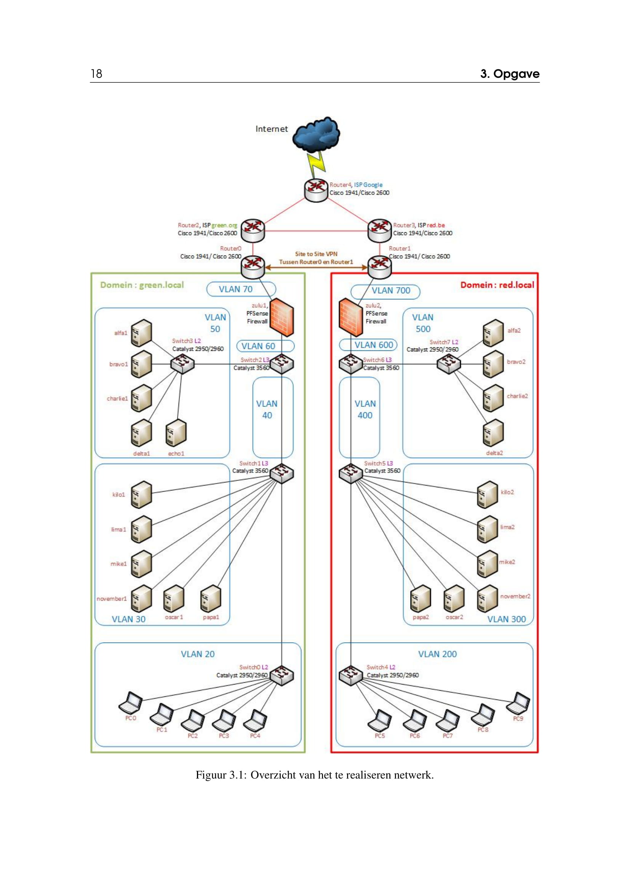

# Algemene informatie

## Taakverdeling

|  Server    |      Beschrijving    |           Naam          |
|------------|----------------------|-------------------------|
|Alpha 1     | Active Directory     |Lennert en Ismail        |
|Bravo 1     | DNS                  |Jens, Max en Kenzie      |
|Charlie 1   | DNS Slave            |Jens, Max en Kenzie      |
|Delta 1     | Mailserver           |Robin en Rob             |
|Echo  1     | LAMP & Drupal        |Dennis en Julian         |
|November 1  | MariaDB              |Mauritz                  |
|Mike 1      | CMS (na MariaDB)     |Dennis, Julian en Mauritz|
|Kilo 1      | DHCP server          |Michiel en Alex          |
|Lima 1      | Fileserver (na AD)   |Keanu                    |
|Oscar 1     | Monitoringsysteem    |Thomas en Robin          |
|Papa 1      | PXE boot (na Kilo 1) |Thibo en Niel            |
|Quebec 1    | DNS (samen Windows)  |Jarne en Artuur         |
|Zulu 1      | Firewall             |Max en Kenzie            |
|Netwerkteam | IP adressering       |Michiel en Alex          |

## IP adressen & RAM
| Naam      	| Hostname 	| Webadres         	| IP         	| RAM (<b>6400MB</b>)/8192        	|
|-----------	|----------	|------------------	|------------	|------------	 |
| alfa1     	| /        	| dc.green.local   	| 172.16.0.3 |512MB          |
| bravo1    	| /        	| ns1.green.local  	| 172.16.0.4	|512MB         |
| charlie1  	| /        	| ns2.green.local  	| 172.16.0.5	|512MB         |
| delta1    	| /        	| mail.green.local 	| 172.16.0.6	|512MB         |
| echo1     	| /        	| www.green.local  	| 172.16.0.7	|512MB         |
| kilo1     	| /        	| /                	| 172.16.0.34 |512MB         |
| lima1     	| /        	| /                	| 172.16.0.35	|512MB         |
| mike1     	| /        	| /                	| 172.16.0.36	|512MB         |
| november1 	| /        	| /                	| 172.16.0.37	|512MB         |
| oscar1    	| /        	| /                	| 172.16.0.38	|256MB         |
| papa1     	| /        	| /                	| 172.16.0.39	|512MB         |
| quebec1   	| /        	| /                	| 172.16.0.40 |512MB         |
| zulu1   	  | /        	| /                	| 172.16.0.70; 172.16.0.73 (wan) |512MB         |
#
# Het netwerk

