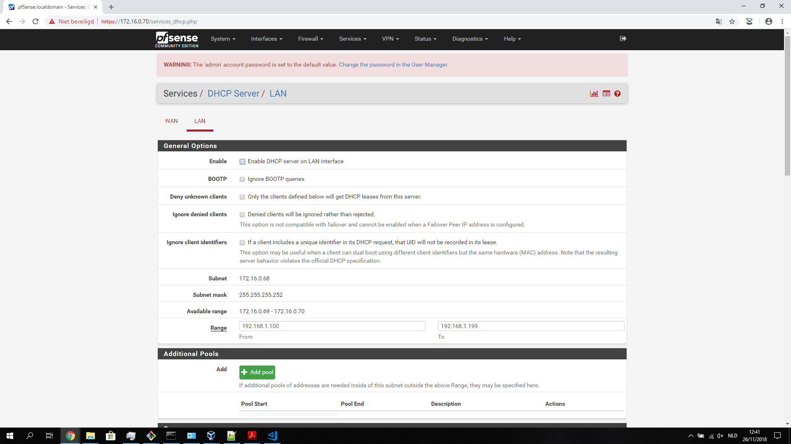

# Handleiding voor Zulu1

*Zulu1 is gebaseerd op een open source router/firewall OS PfSense. Acces VM-Ware 172.22.2.12.*

Auteur(s):

* Kenzie Coddens

## PfSense OS Downloaden

* [Download](https://frafiles.pfsense.org/mirror/downloads/pfSense-CE-2.4.4-RELEASE-amd64.iso.gz) de PfSense OS.
* Link: <https://frafiles.pfsense.org/mirror/downloads/pfSense-CE-2.4.4-RELEASE-amd64.iso.gz>

## Host machine kiezen

*Pfsense is niet gevoelig op welke host het geinstalleerd wordt vermits het een OS op zich is. Voor dit project is het gemakkelijk om als basis machine CentOs7.5 (RedHat 64bit) te gebruiken.*

* Maak in virtualbox een nieuwe machine:
  * Type: Linux
  * Versie: RedHat(64 bit)
  * Geheugen (RAM): >= 512mb
  * Opslag capaciteit: 10gb (hangt af van hoelang logs bijgehouden worden)
* De voor geconfigureerde instellingen moeten gewijzigd worden:
  * Beeldscherm:
    * Videogeheugen: 128mb
  * Netwerk:
    * Adapter1: Intel PRO/1000 MT Desktop (Host-only adapter, 'VirtualBox Host-Only Ethernet Adapter')
    * Adapter2: Intel PRO/1000 MT Desktop (Host-only adapter, 'VirtualBox Host-Only Ethernet Adapter #2')
  * Opslag:
    * SATA-poort 0: PfSense2.vdi
* De machine is nu klaar om te booten.

## Basis installatie

* Boot de machine. (Dit kan even duren)
* Druk op `Enter` en accepteer de licentie voorwaarden.
* Selecteer .

## Basis configuratie LAN-interface

*WAARSCHUWING: Het onderstaande is uitgevoerd via SSH! Uw ervaring kan verschillen!*

```bash
*** Welcome to pfSense 2.4.4-RELEASE (amd64) on Zulu1 ***

 WAN (wan)       -> em0        -> v4: 172.16.0.73/30
 LAN (lan)       -> em1        -> v4: 172.16.0.70/30

 0) Logout (SSH only)                  9) pfTop
 1) Assign Interfaces                 10) Filter Logs
 2) Set interface(s) IP address       11) Restart webConfigurator
 3) Reset webConfigurator password    12) PHP shell + pfSense tools
 4) Reset to factory defaults         13) Update from console
 5) Reboot system                     14) Disable Secure Shell (sshd)
 6) Halt system                       15) Restore recent configuration
 7) Ping host                         16) Restart PHP-FPM
 8) Shell

Enter an option: 2

Available interfaces:

1 - WAN (em0 - static)
2 - LAN (em1 - static)

Enter the number of the interface you wish to configure: 2

Enter the new LAN IPv4 address.  Press <ENTER> for none:
> 172.16.0.70

Subnet masks are entered as bit counts (as in CIDR notation) in pfSense.
e.g. 255.255.255.0 = 24
     255.255.0.0   = 16
     255.0.0.0     = 8

Enter the new LAN IPv4 subnet bit count (1 to 31):
> 30

For a WAN, enter the new LAN IPv4 upstream gateway address.
For a LAN, press <ENTER> for none:
>

Enter the new LAN IPv6 address.  Press <ENTER> for none:
>

Do you want to enable the DHCP server on LAN? (y/n) n

Do you want to revert to HTTP as the webConfigurator protocol? (y/n) n

Please wait while the changes are saved to LAN...
 Reloading filter...
 Reloading routing configuration...
 DHCPD...

The IPv4 LAN address has been set to 172.16.0.70/30
You can now access the webConfigurator by opening the following URL in your web browser:
                https://172.16.0.70/

Press <ENTER> to continue.
VirtualBox Virtual Machine - Netgate Device ID: 341f74ac487942464a27
```

## Configureren van LAN-Interface in windows

* Ga in configuratie scherm naar `netwerkadapter instellingen`
* Selecteer de juist host-only adapter. (Dat is de interface waar de LAN van PfSense mee verbonden is. Dit is standaard de 2de interface in de lijst in virtualbox)
* Configureer deze adapter met de volgende instellingen:
  * Ip-adres: 172.16.0.69
  * Subnetmasker: 255.255.255.252
  * Standaardgateway: 172.16.0.70
* Controleer deze intellingen met `Command prompt` van windows:

```powershell
C:\Users\kenzi>ipconfig

Windows IP Configuration

Ethernet adapter VirtualBox Host-Only Network:

   Connection-specific DNS Suffix  . :
   Link-local IPv6 Address . . . . . : fe80::1be:a78d:5b7a:5882%8
   IPv4 Address. . . . . . . . . . . : 172.16.0.69
   Subnet Mask . . . . . . . . . . . : 255.255.255.252
   Default Gateway . . . . . . . . . : 172.16.0.70
```

* Als instellingen correct zijn zowel bij PfSense als bij windows dan lukt `ping`.

```powershell
C:\Users\kenzi>ping 172.16.0.70

Pinging 172.16.0.70 with 32 bytes of data:
Reply from 172.16.0.70: bytes=32 time<1ms TTL=64
Reply from 172.16.0.70: bytes=32 time<1ms TTL=64
Reply from 172.16.0.70: bytes=32 time<1ms TTL=64
Reply from 172.16.0.70: bytes=32 time<1ms TTL=64

Ping statistics for 172.16.0.70:
    Packets: Sent = 4, Received = 4, Lost = 0 (0% loss),
Approximate round trip times in milli-seconds:
    Minimum = 0ms, Maximum = 0ms, Average = 0ms
```

* Ook `ping` vanop de PfSense machine moet lukken:

```bash
*** Welcome to pfSense 2.4.4-RELEASE (amd64) on Zulu1 ***

 WAN (wan)       -> em0        -> v4: 172.16.0.73/30
 LAN (lan)       -> em1        -> v4: 172.16.0.70/30

 0) Logout (SSH only)                  9) pfTop
 1) Assign Interfaces                 10) Filter Logs
 2) Set interface(s) IP address       11) Restart webConfigurator
 3) Reset webConfigurator password    12) PHP shell + pfSense tools
 4) Reset to factory defaults         13) Update from console
 5) Reboot system                     14) Disable Secure Shell (sshd)
 6) Halt system                       15) Restore recent configuration
 7) Ping host                         16) Restart PHP-FPM
 8) Shell

Enter an option: 7


Enter a host name or IP address: 172.16.0.69

PING 172.16.0.69 (172.16.0.69): 56 data bytes
64 bytes from 172.16.0.69: icmp_seq=0 ttl=128 time=0.388 ms
64 bytes from 172.16.0.69: icmp_seq=1 ttl=128 time=0.487 ms
64 bytes from 172.16.0.69: icmp_seq=2 ttl=128 time=0.365 ms

--- 172.16.0.69 ping statistics ---
3 packets transmitted, 3 packets received, 0.0% packet loss
round-trip min/avg/max/stddev = 0.365/0.413/0.487/0.053 ms

Press ENTER to continue.
```

## Openen van SSH poorten

*WAARSCHUWING: Het onderstaande is uitgevoerd via SSH! Uw ervaring kan verschillen!*

```bash
*** Welcome to pfSense 2.4.4-RELEASE (amd64) on Zulu1 ***

 WAN (wan)       -> em0        -> v4: 172.16.0.73/30
 LAN (lan)       -> em1        -> v4: 172.16.0.70/30

 0) Logout (SSH only)                  9) pfTop
 1) Assign Interfaces                 10) Filter Logs
 2) Set interface(s) IP address       11) Restart webConfigurator
 3) Reset webConfigurator password    12) PHP shell + pfSense tools
 4) Reset to factory defaults         13) Update from console
 5) Reboot system                     14) Disable Secure Shell (sshd)
 6) Halt system                       15) Restore recent configuration
 7) Ping host                         16) Restart PHP-FPM
 8) Shell

Enter an option: 14

SSHD is currently enabled.  Would you like to disable? [y/n]? y
VirtualBox Virtual Machine - Netgate Device ID: 341f74ac487942464a27
```

* SSH moet lukken op de LAN-interface:

```bash
$ ssh admin@172.16.0.70
Password for admin@Zulu1.green.local:
VirtualBox Virtual Machine - Netgate Device ID: 341f74ac487942464a27

*** Welcome to pfSense 2.4.4-RELEASE (amd64) on Zulu1 ***

 WAN (wan)       -> em0        -> v4: 172.16.0.73/30
 LAN (lan)       -> em1        -> v4: 172.16.0.70/30

 0) Logout (SSH only)                  9) pfTop
 1) Assign Interfaces                 10) Filter Logs
 2) Set interface(s) IP address       11) Restart webConfigurator
 3) Reset webConfigurator password    12) PHP shell + pfSense tools
 4) Reset to factory defaults         13) Update from console
 5) Reboot system                     14) Disable Secure Shell (sshd)
 6) Halt system                       15) Restore recent configuration
 7) Ping host                         16) Restart PHP-FPM
 8) Shell

Enter an option:
```

## Auto Configuratie via USB

*Het volgende beschrijft hoe een reeds gemaakte [conf.xml](../config_file/config.xml) kan herstelt worden.*

* Het opzetten van de machine blijft hetzelfde.
* Bij eerste boot naar appartaten gaan en de usb-stick selecteren die voldoet volgens [researsh](/docs/documentatie/research/research-zulu1.md).
* Zelfde stappen doorlopen als normale installatie.
* Bij reboot wachten tot dat server efectief aan het booten is. (Normaal is dat pas na het zien van PfSense logo).
* Stick los koppelen.
* Configuratie wordt normaal automatisch herstelt.

## Auto configuratie via WebGui

*Machine is reeds volledig geinstalleerd en de Lan-interface is al geconfigureerd. Machine is geboot en instellingen van host zijn correct. Er is op de host machine een `conf.xml` aanwezig.*

* Login in de WebGui.
* Navigeer naar `Diagnostics` en klik op `BackUp & Restore`.
* Klik op `Bestand kiezen`.
* Navigeer naar uw bestand op uw host.
* Klik `Restore Configuratie`.

## Auto configuratie door middel van `scp`

*Voor dat u dit uitvoert moet u zorgen dat u reeds een backup config.xml heeft gedownload en hernoemd naar config.xml.*

* Installeer pfSense zoals normaal.
* Stel de LAN-Adapter correct in.
* Enable SSHD.
* Open een teminal op een host systeem.
* Doe een `scp` vanop de host naar de server.

```bash
kenzi@Laptop-KC MINGW64 /d/kenzie/Documents/Projecten - Workshops 3/Git/p3ops-green (master)
$ scp Servers/zulu1/config_file/config.xml root@172.16.0.70:/cf/conf/config.xml
Password for root@Zulu1.green.local:
config.xml                                                  100%   14KB   1.8MB/s   00:00
```

* SSH in pfSense en doe een reboot.

```bash
kenzi@Laptop-KC MINGW64 /d/kenzie/Documents/Linux/Git/repo (solution)
$ ssh root@172.16.0.70
Password for root@Zulu1.green.local:
VirtualBox Virtual Machine - Netgate Device ID: 1a6169e2e8e00ee7a254

*** Welcome to pfSense 2.4.4-RELEASE (amd64) on Zulu1 ***

 WAN (wan)       -> em0        -> v4: 172.16.0.73/30
 LAN (lan)       -> em1        -> v4: 172.16.0.70/30

 0) Logout (SSH only)                  9) pfTop
 1) Assign Interfaces                 10) Filter Logs
 2) Set interface(s) IP address       11) Restart webConfigurator
 3) Reset webConfigurator password    12) PHP shell + pfSense tools
 4) Reset to factory defaults         13) Update from console
 5) Reboot system                     14) Disable Secure Shell (sshd)
 6) Halt system                       15) Restore recent configuration
 7) Ping host                         16) Restart PHP-FPM
 8) Shell

Enter an option: 5


pfSense will reboot. This may take a few minutes, depending on your hardware.
Do you want to proceed?

    Y/y: Reboot normally
    R/r: Reroot (Stop processes, remount disks, re-run startup sequence)
    S: Reboot into Single User Mode (requires console access!)
    F: Reboot and run a filesystem check

Enter an option: y

pfSense is rebooting now.
Connection to 172.16.0.70 closed by remote host.
Connection to 172.16.0.70 closed.

```

## Configureren van Firewall via WebGui

*Hier gaan we ervan uit dat er een clean install van pfsense reeds uitgevoerd is. Ook bent u reeds ingelogt in het webportaal met root: pfsense.*

### WAN-interface instellen

* Klik op interfaces en ga naar WAN.


* Stel daar deze settings in:
  * IPv4 Configuration Type: `Static IPv4`
  * IPv6 Configuration Type: `none`
  * IPv4 Address: `172.16.0.73`
  * / `30``
  * Block private networks and loopback addresses: `Uncheck`
  * Block bogon networks: `check`


* Klik op `save`.
* Vergeet niet vanboven aan de pagina op `Apply changes` te klikken.

### LAN-interface instellen

* Klik op interfaces en ga naar LAN.


* Stel daar deze settings in:
  * IPv4 Configuration Type: `Static IPv4`
  * IPv6 Configuration Type: `none`
  * IPv4 Address: `172.16.0.70`
  * / `30``
  * Block private networks and loopback addresses: `Uncheck`
  * Block bogon networks: `check`


* Klik op `save`.
* Vergeet niet vanboven aan de pagina op `Apply changes` te klikken.

### Alle routing opties uitzetten

* Ga onder `firewall` naar `NAT`.


* Kies dan voor `Outbound`.
* Configureer outbound NAT Mode naar `Disable Outbound NAT rule generation.(No Outbound NAT rule).


* Klik op `Save`.
* Vergeet niet vanboven aan de pagina op `Apply changes` te klikken.

### DHCP afzetten

* Klik op `Services`.
* Ga naar `DHCP Server`.


* Normaal komt u standaard op de LAN uit.
* Zorg dat `Enable` op unchecked staat.



* Klik op `Save`.
* Vergeet niet vanboven op de pagina op `Apply changes` te klikken.

* Klik nu op `WAN` dat naast `LAN` staat.
* Zorg dat `Enable` op unchecked staat.


* Klik op `Save`.
* Vergeet niet vanboven op de pagina op `Apply changes` te klikken.

### LAN firewall rules toevoegen

*Hier wordt kort beschreven hoe uw gemakkelijk via de webgui een firewall rule gaat toevoegen. Hier gaan we een rule toevoegen voor FTP & PING.*

#### Normal firewall rules

* Klik op `Firewall`.
* Ga naar `Rules`.


* Nu ziet U normaal gezien het rule screen voor de `WAN` kant.
* Navigeer naar het `LAN` paneel.
* Klik van onder op `add`.


* Kies bij `Edit Firewall Rule` uw gewenste protocol. (hier kiezen we voor TCP)
* Kies nu bij `Destination` de juiste `Destination Port Range`. (Hier kiezen we voor `FTP(21)`)

*We kiezen hier voor destination en niet voor source vermits we wensen dat elke binnen komende verbinding toegestaan is zolang de destination poort 21 is.*

* Vul nu bij `Extra Options` een gepaste `Description` in zoals bv `LAN_FTP_PASS`.


* Klik nu vanonder aan de pagina op `Save`.
* Vergeet niet van boven op `Apply Changes` te klikken zodanig dat de nieuwe rule applied wordt.
* Nu heeft U succesvol een nieuwe firewall rule toegevoegd.

#### Ping firewll rules

* Klik op `Firewall`.
* Ga naar `Rules`.


* Nu ziet U normaal gezien het rule screen voor de `WAN` kant.
* Navigeer naar het `LAN` paneel.
* Klik van onder op `add`.


* Kies bij `Edit Firewall Rule` voor ICMP vermits we een ping rule willen toevoegen.
* Vul nu bij `Extra Options` een gepaste `Description` in zoals bv `LAN_PING_PASS`.


* Klik nu vanonder aan de pagina op `Save`.
* Vergeet niet van boven op `Apply Changes` te klikken zodanig dat de nieuwe rule applied wordt.
* Nu heeft U succesvol een nieuwe firewall rule toegevoegd voor ping.

### WAN firewall rules toevoegen

*Hier wordt kort beschreven hoe uw gemakkelijk via de webgui een firewall rule gaat toevoegen. Hier gaan we een rule toevoegen voor FTP & PING.*

#### Normal Firewall rules

* Klik op `Firewall`.
* Ga naar `Rules`.


* Nu ziet U normaal gezien het rule screen voor de `WAN` kant.
* Klik van onder op `add`.


* Kies bij `Edit Firewall Rule` uw gewenste protocol. (hier kiezen we voor TCP)
* Klik bij `Source` op `Display Advanced`.
* Kies nu bij `Source` de juiste `Destination Port Range`. (Hier kiezen we voor `FTP(21)`)
* Vul nu bij `Extra Options` een gepaste `Description` in zoals bv `WAN_FTP_PASS`.


* Klik nu vanonder aan de pagina op `Save`.
* Vergeet niet van boven op `Apply Changes` te klikken zodanig dat de nieuwe rule applied wordt.
* Nu heeft U succesvol een nieuwe firewall rule toegevoegd.

#### Ping Firewall rules

* Klik op `Firewall`.
* Ga naar `Rules`.


* Nu ziet U normaal gezien het rule screen voor de `WAN` kant.
* Klik van onder op `add`.


* Kies bij `Edit Firewall Rule` voor ICMP vermits we een ping rule willen toevoegen.
* Vul nu bij `Extra Options` een gepaste `Description` in zoals bv `WAN_PING_PASS`.


* Klik nu vanonder aan de pagina op `Save`.
* Vergeet niet van boven op `Apply Changes` te klikken zodanig dat de nieuwe rule applied wordt.
* Nu heeft U succesvol een nieuwe firewall rule toegevoegd voor ping.

### Sartpagina opties aanzetten

* Op de Home screen, klik in de `Dashboard` bar op het rode plusje.
* Kies nu uit de lijst de gewenste applicatie.


## Bronnen

* [pfSense-site](https://www.pfsense.org/)
* [netgate](https://www.netgate.com/)