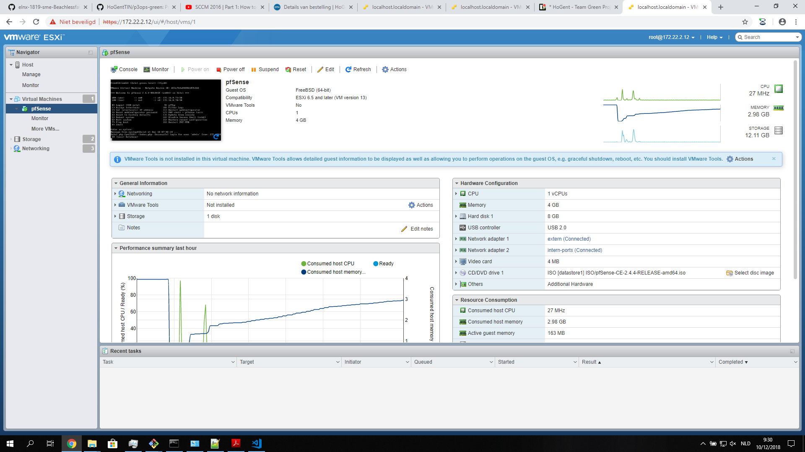
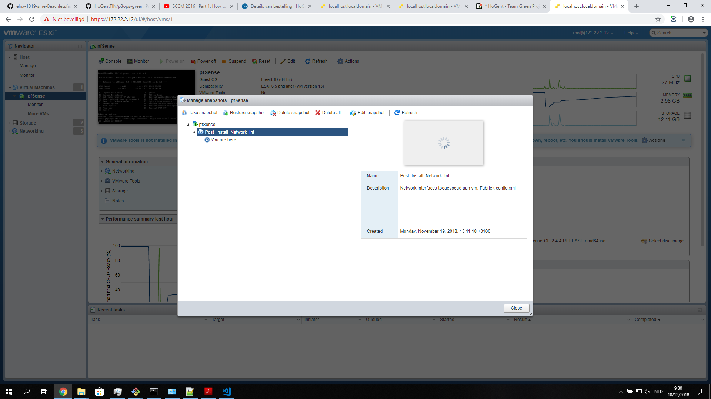
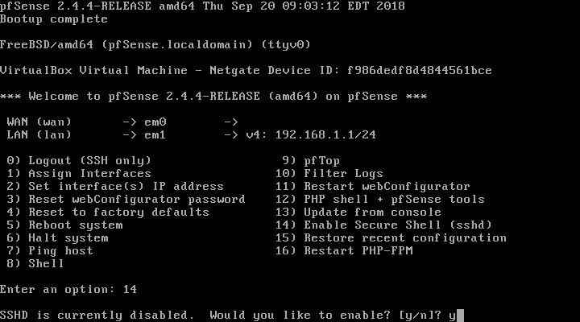

# Handleiding voor deployment van Zulu1 op vm-ware

*Deze handleiding beschrijft kort een aantal stappen over hoe pfSense kan deployed worden op vm-ware. Hiervoor gebruiken we NetLab002 waar als OS vm-ware esxi op geinstaleerd staat. De machine is uitegerust met 3 fysieke netwerk adapters. Een voor de host os remote te bedienen en twee andere die zullen functioneren als Wan en Lan adapter voor de VM.*

## Gebruikte tools

* Vm-ware remote console
* Code editor
* Terminal

## Restore basic snapshot

* Host OS te bereiken op `172.22.2.12`.
* Inlog gegevens:
  * Username: `root`
  * Password: `Projecten3`

* Navigeer nu naar de virtuele machine.
* Zorg dat u onderstaand scherm te zien krijgt.



* Klik nu op `Actions`.
* Navigeer naar `Manage Snapshots`.
* Resotre snapshot `Post_install_Network_int`.



* Sluit dit venster en bekijk ofdat restore succesvol uitgevoerd is.
  * Indien dit fout gelopen is probeer opnieuw.
  * Geslaagd, ga verder.

## SSH enablen op pfSense

* Klik vanboven op `Power On`.
* Ga onder `Actions` naar `Console` en kies voor `Remote Console`.

*Dit zal alleen maar werken als U reeds een `VRMC` geinstalleert heeft op uw systeem. Deze is gratis te verkrijgen op de [website](https://my.vmware.com/web/vmware/details?downloadGroup=VMRC1003&productId=742) van VM-ware.*

* Nu zou U een terminal moeten zien met de interface van pfSense.
* Type `14` om de `SSHD` te doen runnen zodanig dat we via `ssh` kunnen inloggen op pfSense.
* Type `Y` voor te bevestigen.



## Via SSH remote pfsense bereiken

*Zorg ervoor dat U toegang heeft tot de LAN en de WAN van pfSense.*

* Plug in langs de LAN kant met Uw systeem.
* DHCP is standaard enabled dus uw zou een ip moeten krijgen.
* Log nu in met `ssh root@192.168.1.1`.
* Type `yes` en als wachtwoord `pfsense`.

```bash
kenzi@Laptop-KC MINGW64 /d/kenzie/Documents/Linux/Git/repo (solution)
$ ssh root@192.168.1.1
The authenticity of host '192.168.1.1 (192.168.1.1)' can't be established.
ED25519 key fingerprint is SHA256:sue4ZPAaZCaTIrUJ2rdv1tUtpOrunYfJwtnrIGtKqmo.
Are you sure you want to continue connecting (yes/no)? yes
Warning: Permanently added '192.168.1.1' (ED25519) to the list of known hosts.
Password for root@pfSense.localdomain:
VirtualBox Virtual Machine - Netgate Device ID: f986dedf8d4844561bce

*** Welcome to pfSense 2.4.4-RELEASE (amd64) on pfSense ***

 WAN (wan)       -> em0        ->
 LAN (lan)       -> em1        -> v4: 192.168.1.1/24

 0) Logout (SSH only)                  9) pfTop
 1) Assign Interfaces                 10) Filter Logs
 2) Set interface(s) IP address       11) Restart webConfigurator
 3) Reset webConfigurator password    12) PHP shell + pfSense tools
 4) Reset to factory defaults         13) Update from console
 5) Reboot system                     14) Disable Secure Shell (sshd)
 6) Halt system                       15) Restore recent configuration
 7) Ping host                         16) Restart PHP-FPM
 8) Shell

Enter an option:
```

* `ctrl-D` om eruit te gaan.

## De config van pfSense te restoren

*Zorg ervoor dat U een kopie bezit van de [GitHub](https://github.com/HoGentTIN/p3ops-green). Anders zal dit script niet werken.*

* Open een nieuwe terminal.
* Voer het volgende commando uit `./Servers/zulu1/script/run_auto_restore.sh`.

```bash
MacBook-Pro-van-Kenzie:p3ops-green kenzie$ ./Servers/zulu1/script/run_aut
o_restore.sh
spawn scp /Users/kenzie/Documents/HoGent/Projecten_Workshops_3/Git/p3ops-
green/Servers/zulu1/config_file/config.xml root@192.168.1.1:/cf/conf/
Password for root@pfSense.localdomain:
config.xml                             100%   27KB   8.6MB/s   00:00
spawn scp /Users/kenzie/Documents/HoGent/Projecten_Workshops_3/Git/p3ops-
green/Servers/zulu1/script/reboot.sh root@192.168.1.1:/tmp/
Password for root@pfSense.localdomain:
reboot.sh                              100%  354   191.6KB/s   00:00
spawn ssh root@192.168.1.1 '/tmp/reboot.sh'
Password for root@pfSense.localdomain:
Connection to 192.168.1.1 closed by remote host.
MacBook-Pro-van-Kenzie:p3ops-green kenzie$
```

* Nu zou de pfSense moeten rebooten en zou u moeten opmerken dat de domain naam `zullu1.green.local` geworden is.

## Connecteren met webgui

* Login gegevens:
  * User: `admin`
  * Password: `Admin2018`

### LAN

* Ip-instellingen voor verbinding met LAN-kant
  * ip-adres: `172.16.0.69`
  * Subnetmask: `255.255.255.252`
  * DG/Router: `172.16.0.70`
* Web-gui is bereikbaar op `172.16.0.70`

### WAN

* Ip-instellingen voor verbinding met WAN-kant
  * ip-adres: `172.16.0.74`
  * Subnetmask: `255.255.255.252`
  * DG/Router: `172.16.0.73`
* Web-gui is bereikbaar op `172.16.0.73`